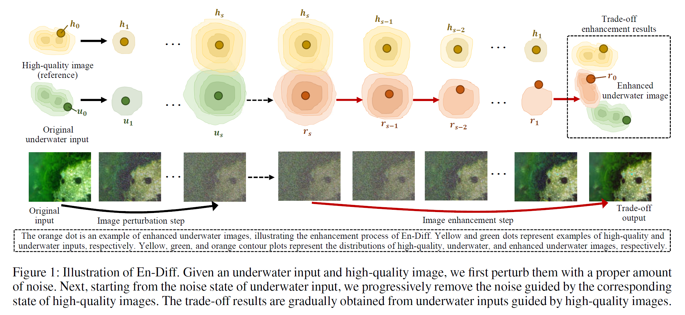
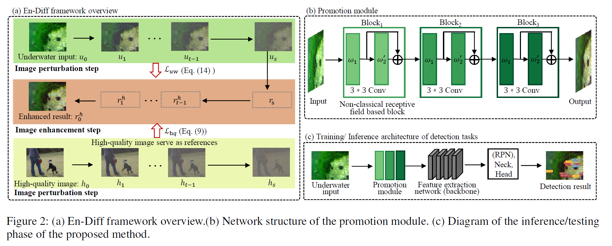

# En-Diff
This repo is the official implementation of [En-Diff: Learning from Unpaired High-Quality and Underwater Images for
Marine Object Detection](). It is based on [mmdetection](https://github.com/open-mmlab/mmdetection/tree/2.x) (v2.28.2).
## Introduction
The paper aims to use unpaired high-quality and underwater images as training data for image enhancement to improve downstream detection tasks. The key challenge is to generate enhanced images that remain relatively proximate to the distribution of underwater inputs while also approaching the distribution of high-quality images. To find the trade-off results, we propose an enhancement paradigm called En-Diff. En-Diff consists of image perturbation and enhancement steps. The first step adds appropriate Gaussian noise to the unpaired data to smooth out certain image differences while preserving the overall appearance of the underwater input. The second step produces trade-off enhancement results through iterative denoising guided by high-quality images. Finally, En-Diff unrolls to a well-designed promotion module. Evaluations on real-world underwater datasets demonstrate that EnDiff outperforms state-of-the-art detection methods.

## Framework and Promotion Module
As shown in Fig.2 (a), the image perturbation step adds suitable noise to unpaired underwater and high-quality images to smooth out some image content differences, while still preserving the overall appearance of the underwater input. And the image enhancement step, starting from the noise state of the underwater input of the image perturbation step, enhances underwater images by iterative denoising guided by high-quality images.
- We use underwater images from the URPC2020 dataset, which can be downloaded from [here](https://github.com/xiaoDetection/learning-cruxes-to-push/releases/download/release_datasets/urpc2020.zip).
- We use high-quality images from the COCO dataset, which can be download from [here](https://cocodataset.org/#download).

As shown in Fig.2 (b), En-Diff unrolls to a promotion module, improving the distribution quality of underwater images. The promotion module is inspired by the non-classical receptive field of human vision (Chao-Yi et al. 1991). The non-classical receptive field is good at enhancing the high frequencies (Wang et al. 2020; Chao-Yi et al. 1991).



## Models and Results
|Method|Backbone|Pretrain|$AP$|$AP_{50}$|$AP_{75}$|Model|
|:-|:-|:-|:-|:-|:-|:-|
|EnDiff-r50|ResNet50|[cascade_rcnn_r50_coco2017]()|49.9|82.8|52.6|[endiff_r50_urpc]()|
|EnDiff-xt101|ResNetXT101|[cascade_rcnn_xt101_coco2017]()|50.5|84.1|54.4|[endiff_xt101_urpc]()|


## Usage
### Installing
To create a new environment, run:
```shell
conda create -n endiff python=3.10 -y
conda activate endiff
```
To install pytorch run:
```shell
conda install pytorch==1.13.1 torchvision==0.14.1 torchaudio==0.13.1 pytorch-cuda=11.6 -c pytorch -c nvidia -y
```
To install mmdetection, run:
```shell
pip install mmcv-full==1.7.1 -f https://download.openmmlab.com/mmcv/dist/cu116/torch1.13/index.html 

pip install yapf==0.40.1 numpy==1.26.4 mmdet==2.28.2
```
To clone EnDiff, run:
```shell
git clone https://github.com/xiaoDetection/en-diff.git
cd en-diff
```
### Data Preperation
The data should be orginized as follow:
```
en-diff/
    data/
        urpc2020/
            annotations/
            images/
        coco2017/
            train2017/
```


### Testing
Here we take testing `EnDiff-r50` as an example.

First download our checkpoint file to `checkpoints/endiff_r50_urpc.pth`:
```shell
mkdir checkpoints
wget -P ./checkpoints/ https://github.com/xiaoDetection/
```
Then test our model (set '--cfg-options' to avoid loading pre-trained weights):
```shell
python tools/test.py \
    configs/EnDiff_r50.py \
    ./checkpoints/endiff_r50_urpc.pth \
    --eval bbox \
    --cfg-options model.init_cfg=None
```
### Training

Fist download our pre-trained model:
```shell
wget -P ./checkpoints/ https://github.com/xiaoDetection/
```
Then train a model:
```shell
python tools/train.py \
    configs/EnDiff_r50.py
```

The results will be saved in `work_dirs/EnDiff_r50/`. 

### Training on a custom dataset
Please convert the annotations into COCO format and place them and images into `data/` folder accoriding to the structure described [above](#data-preperation).

Then, make a copy of the configuration file, and modify following settings:
- `num_classes`: the number of classes.
- `data_root`: the path of the dataset folder.
- `train_ann`: the path of the training annotations.
- `test_ann`: the path of the testing annotations.
- `classes`: a tuple of class names.

Finally, train a model:
```shell
python tools/train.py \
    YOUR_CONFIG_FILE.py
```

The results will be saved in `work_dirs/YOUR_CONFIG_FILE/`.

**Notes:**
- For more information (e.g., about modifying runtime settings), please refer to [MMDetection's documentation](https://mmdetection.readthedocs.io/en/v2.28.2/).

## Citation
```
```